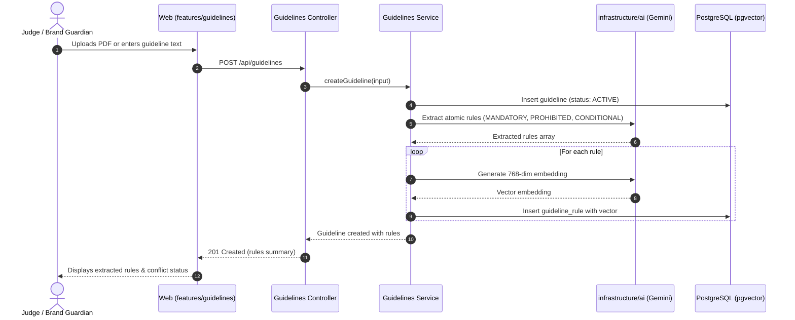

# Guideline Ingestion & Rule Embedding Flow

> **Owner:** Mann (Guideline Knowledge Engineer)
> **Reviewer:** Pratham (Project Lead)

---

## Sequence Flow

```mermaid
sequenceDiagram
    autonumber
    actor Judge as Judge / Brand Guardian
    participant Web as Web (features/guidelines)
    participant Controller as Guidelines Controller
    participant Service as Guidelines Service
    participant AI as infrastructure/ai (Gemini)
    participant DB as PostgreSQL (pgvector)

    Judge->>Web: Uploads PDF or enters guideline text
    Web->>Controller: POST /api/guidelines
    Controller->>Service: createGuideline(input)
    Service->>DB: Insert guideline (status: ACTIVE)
    Service->>AI: Extract atomic rules (MANDATORY, PROHIBITED, CONDITIONAL)
    AI-->>Service: Extracted rules array
    loop For each rule
        Service->>AI: Generate 768-dim embedding
        AI-->>Service: Vector embedding
        Service->>DB: Insert guideline_rule with vector
    end
    Service-->>Controller: Guideline created with rules
    Controller-->>Web: 201 Created (rules summary)
    Web-->>Judge: Displays extracted rules & conflict status
```
