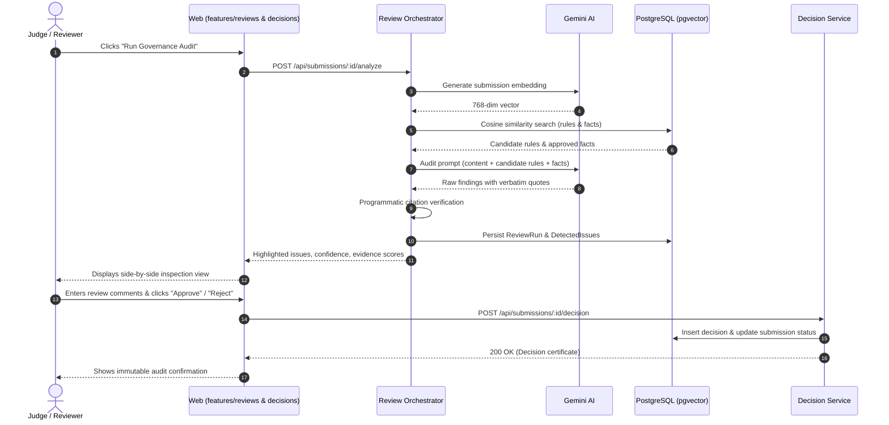

# Review Orchestration & Human Decision Flow

> **Owners:** Ayan & Pratham (Backend) | Pratham Kave (Frontend)

---

## Sequence Flow

```mermaid
sequenceDiagram
    autonumber
    actor Judge as Judge / Reviewer
    participant Web as Web (features/reviews & decisions)
    participant RevService as Review Orchestrator
    participant AI as Gemini AI
    participant DB as PostgreSQL (pgvector)
    participant DecService as Decision Service

    Judge->>Web: Clicks "Run Governance Audit"
    Web->>RevService: POST /api/submissions/:id/analyze
    RevService->>AI: Generate submission embedding
    AI-->>RevService: 768-dim vector
    RevService->>DB: Cosine similarity search (rules & facts)
    DB-->>RevService: Candidate rules & approved facts
    RevService->>AI: Audit prompt (content + candidate rules + facts)
    AI-->>RevService: Raw findings with verbatim quotes
    RevService->>RevService: Programmatic citation verification
    RevService->>DB: Persist ReviewRun & DetectedIssues
    RevService-->>Web: Highlighted issues, confidence, evidence scores
    Web-->>Judge: Displays side-by-side inspection view

    Judge->>Web: Enters review comments & clicks "Approve" / "Reject"
    Web->>DecService: POST /api/submissions/:id/decision
    DecService->>DB: Insert decision & update submission status
    DecService-->>Web: 200 OK (Decision certificate)
    Web-->>Judge: Shows immutable audit confirmation
```
