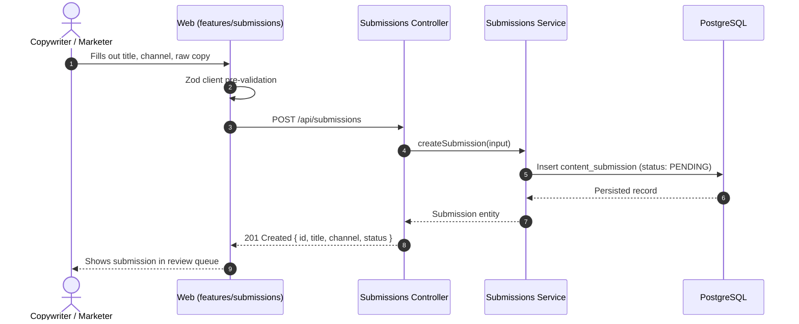

# Content Submission Flow

> **Owner:** Ayan (Backend Lead)
> **Reviewer:** Pratham (Project Lead)

---

## Sequence Flow

```mermaid
sequenceDiagram
    autonumber
    actor Creator as Copywriter / Marketer
    participant Web as Web (features/submissions)
    participant Controller as Submissions Controller
    participant Service as Submissions Service
    participant DB as PostgreSQL

    Creator->>Web: Fills out title, channel, raw copy
    Web->>Web: Zod client pre-validation
    Web->>Controller: POST /api/submissions
    Controller->>Service: createSubmission(input)
    Service->>DB: Insert content_submission (status: PENDING)
    DB-->>Service: Persisted record
    Service-->>Controller: Submission entity
    Controller-->>Web: 201 Created { id, title, channel, status }
    Web-->>Creator: Shows submission in review queue
```
